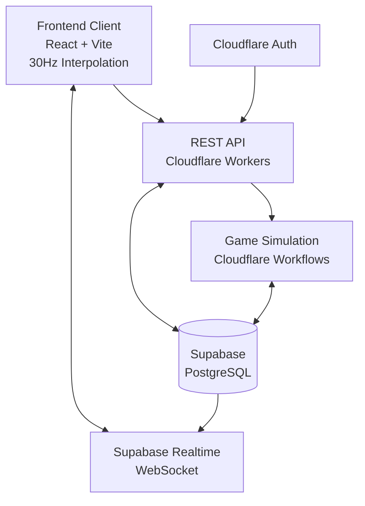

# Design Document

## Overview

Uncharted Territory は、自律的な宇宙経済システムの中でプレイヤーが交易船団を管理する2D宇宙4Xゲームです。本設計では、リアルタイムWebSocketベースのクライアント・サーバーアーキテクチャを採用し、Cloudflare Workers上でサーバレス実装を行います。

## Architecture

### System Architecture



### Technology Stack

**Frontend:**
- React 18 with TypeScript
- Vite for build tooling
- Canvas API for 2D rendering with 30Hz interpolation
- Supabase Realtime for live updates (1Hz server state)

**Backend:**
- Cloudflare Workers for REST API (player actions only)
- Cloudflare Workflows for game simulation orchestration
- Supabase for data persistence and real-time subscriptions
- Cost-optimized architecture for individual development

### Client-Side Interpolation System

**Smooth Animation Strategy:**
- Server sends authoritative state updates at 1Hz
- Client interpolates between states at 30Hz for smooth visuals
- Predictive movement for ships based on current routes
- Immediate UI feedback for player actions with server confirmation

**Interpolation Implementation:**
```typescript
interface InterpolationState {
  previousState: GameState;
  currentState: GameState;
  interpolationFactor: number; // 0.0 to 1.0
  lastUpdateTime: number;
}

class GameStateInterpolator {
  interpolateShipPositions(ships: Ship[], factor: number): Ship[] {
    // Linear interpolation between previous and current positions
    // Predictive extrapolation for ships in transit
  }
  
  smoothPriceTransitions(prices: PriceData[], factor: number): PriceData[] {
    // Smooth price changes to avoid jarring updates
  }
}
```

### Cloudflare Workflows Integration

**Cost-Efficient Game Simulation:**
- Single workflow instance manages all game simulation
- Scheduled execution every 1 second via Cron Triggers
- Workflow state persists between executions
- Automatic error recovery and retry logic

**Workflow Architecture:**
```typescript
interface GameWorkflowState {
  lastExecutionTime: number;
  activePlayerCount: number;
  economicCycleCounter: number;
  errorCount: number;
}

class GameSimulationWorkflow {
  async execute(state: GameWorkflowState): Promise<GameWorkflowState> {
    // 1. Load active game states from Supabase
    // 2. Run economic simulation (production/consumption)
    // 3. Execute trading AI for all players
    // 4. Update ship positions and routes
    // 5. Calculate price changes
    // 6. Save updated state to Supabase
    // 7. Trigger Supabase Realtime updates
  }
}
```

**Database:**
- Supabase (PostgreSQL)
- Real-time subscriptions for live updates

## Components and Interfaces

### Core Game Components

#### 1. Game State Manager
```typescript
interface GameState {
  playerId: string;
  credits: number;
  ships: Ship[];
  sectors: Sector[];
  currentTime: number;
  economicCycle: number;
}

interface Ship {
  id: string;
  name: string;
  position: Vector2D;
  cargo: CargoItem[];
  capacity: number;
  speed: number;
  status: ShipStatus;
  currentRoute?: TradeRoute;
  aiEnabled: boolean;
}
```

#### 2. Economic System
```typescript
interface Station {
  id: string;
  type: StationType;
  position: Vector2D;
  inventory: Inventory;
  productionCycle: ProductionCycle;
  laborBonus: number;
}

interface Inventory {
  items: Map<string, InventoryItem>;
}

interface InventoryItem {
  commodity: string;
  quantity: number;
  basePrice: number;
  currentPrice: number;
  priceElasticity: number;
}
```

#### 3. Trading AI System
```typescript
interface TradingAI {
  playerId: string;
  personality: AIPersonality;
  minProfitThreshold: number;
  evaluateRoutes(ships: Ship[], gameState: GameState): TradeRoute[];
}

interface AIPersonality {
  profitWeight: number;    // w1
  timeWeight: number;      // w2
  competitionWeight: number; // w3
}

interface TradeRoute {
  buyStation: string;
  sellStation: string;
  commodity: string;
  expectedProfit: number;
  travelTime: number;
  competitionScore: number;
}
```

### Frontend Components

#### 1. Game Canvas Component
```typescript
interface GameCanvasProps {
  gameState: GameState;
  onStationSelect: (stationId: string) => void;
  onShipSelect: (shipId: string) => void;
}

interface ViewportState {
  zoom: number;
  panX: number;
  panY: number;
}
```

#### 2. UI Panel Components
```typescript
interface FleetPanelProps {
  ships: Ship[];
  onShipToggleAI: (shipId: string) => void;
  onShipSell: (shipId: string) => void;
}

interface StationPanelProps {
  station: Station | null;
  priceHistory: PriceHistory[];
  supplyChain: SupplyChainData;
}
```

### WebSocket Message Protocol

```typescript
// Client to Server Messages
type ClientMessage = 
  | { type: 'PURCHASE_SHIP'; shipType: string }
  | { type: 'SELL_SHIP'; shipId: string }
  | { type: 'TOGGLE_SHIP_AI'; shipId: string; enabled: boolean }
  | { type: 'SET_MIN_PROFIT'; amount: number }
  | { type: 'INVEST_GATE'; gateId: string; amount: number };

// Server to Client Messages
type ServerMessage =
  | { type: 'GAME_STATE_UPDATE'; state: GameState }
  | { type: 'ECONOMIC_UPDATE'; stations: Station[] }
  | { type: 'SHIP_UPDATE'; ships: Ship[] }
  | { type: 'PRICE_UPDATE'; prices: PriceData[] };
```

## Data Models

### Database Schema

```sql
-- Players table
CREATE TABLE players (
  id UUID PRIMARY KEY DEFAULT gen_random_uuid(),
  auth_id TEXT UNIQUE NOT NULL,
  credits BIGINT DEFAULT 100000,
  created_at TIMESTAMP DEFAULT NOW(),
  updated_at TIMESTAMP DEFAULT NOW()
);

-- Ships table
CREATE TABLE ships (
  id UUID PRIMARY KEY DEFAULT gen_random_uuid(),
  player_id UUID REFERENCES players(id),
  name TEXT NOT NULL,
  ship_type TEXT NOT NULL,
  position_x FLOAT DEFAULT 0,
  position_y FLOAT DEFAULT 0,
  cargo JSONB DEFAULT '[]',
  capacity INTEGER DEFAULT 1000,
  speed INTEGER DEFAULT 400,
  status TEXT DEFAULT 'idle',
  ai_enabled BOOLEAN DEFAULT true,
  created_at TIMESTAMP DEFAULT NOW()
);

-- Sectors table
CREATE TABLE sectors (
  id UUID PRIMARY KEY DEFAULT gen_random_uuid(),
  name TEXT NOT NULL,
  position_x FLOAT NOT NULL,
  position_y FLOAT NOT NULL,
  size_x FLOAT DEFAULT 2000,
  size_y FLOAT DEFAULT 2000,
  unlocked_at TIMESTAMP
);

-- Stations table
CREATE TABLE stations (
  id UUID PRIMARY KEY DEFAULT gen_random_uuid(),
  sector_id UUID REFERENCES sectors(id),
  name TEXT NOT NULL,
  type TEXT NOT NULL,
  position_x FLOAT NOT NULL,
  position_y FLOAT NOT NULL,
  inventory JSONB DEFAULT '{}',
  production_config JSONB DEFAULT '{}',
  labor_bonus FLOAT DEFAULT 1.0
);

-- Game state table
CREATE TABLE game_states (
  player_id UUID PRIMARY KEY REFERENCES players(id),
  current_time BIGINT DEFAULT 0,
  economic_cycle INTEGER DEFAULT 0,
  unlocked_sectors TEXT[] DEFAULT ARRAY['sector-0'],
  updated_at TIMESTAMP DEFAULT NOW()
);
```

### Game Configuration Data

```typescript
// Commodity definitions
const COMMODITIES = {
  // Raw materials
  ore: { category: 'raw', basePrice: 10, elasticity: 0.3 },
  silicon: { category: 'raw', basePrice: 15, elasticity: 0.3 },
  water: { category: 'raw', basePrice: 5, elasticity: 0.2 },
  carbon: { category: 'raw', basePrice: 8, elasticity: 0.3 },
  
  // Intermediate goods
  steelPlates: { category: 'intermediate', basePrice: 50, elasticity: 0.7 },
  siliconWafers: { category: 'intermediate', basePrice: 80, elasticity: 0.7 },
  microchips: { category: 'intermediate', basePrice: 200, elasticity: 1.0 },
  quantumTubes: { category: 'intermediate', basePrice: 500, elasticity: 1.2 },
  
  // Finished goods
  hullParts: { category: 'finished', basePrice: 300, elasticity: 1.0 },
  food: { category: 'finished', basePrice: 20, elasticity: 0.3 },
  consumerGoods: { category: 'finished', basePrice: 100, elasticity: 0.8 },
  supercomputer: { category: 'luxury', basePrice: 5000, elasticity: 2.0 }
};

// Station type configurations
const STATION_TYPES = {
  mine: {
    produces: ['ore', 'silicon', 'water', 'carbon'],
    consumes: [],
    productionRate: 100,
    cycleTime: 60
  },
  refinery: {
    produces: ['steelPlates', 'siliconWafers'],
    consumes: ['ore', 'silicon'],
    productionRate: 50,
    cycleTime: 60
  },
  factory: {
    produces: ['microchips', 'hullParts', 'food'],
    consumes: ['siliconWafers', 'steelPlates'],
    productionRate: 25,
    cycleTime: 60
  },
  habitat: {
    produces: [],
    consumes: ['food', 'consumerGoods'],
    populationCapacity: 10000,
    laborOutput: 1.2
  }
};
```

## Error Handling

### Client-Side Error Handling

```typescript
class GameErrorHandler {
  static handleWebSocketError(error: Event) {
    console.error('WebSocket error:', error);
    // Attempt reconnection with exponential backoff
    this.reconnectWithBackoff();
  }
  
  static handleGameStateError(error: Error) {
    // Display user-friendly error message
    // Attempt to recover from last known good state
    this.recoverGameState();
  }
  
  static handleRenderError(error: Error) {
    // Fallback to simplified rendering mode
    this.enableFallbackRenderer();
  }
}
```

### Server-Side Error Handling

```typescript
class ServerErrorHandler {
  static async handleDatabaseError(error: Error, context: string) {
    console.error(`Database error in ${context}:`, error);
    // Log to monitoring service
    await this.logError(error, context);
    // Return appropriate error response
    return { success: false, error: 'Database operation failed' };
  }
  
  static handleGameLogicError(error: Error, playerId: string) {
    // Preserve game state integrity
    // Rollback to previous valid state if necessary
    return this.rollbackToSafeState(playerId);
  }
}
```

## Testing Strategy

### Unit Testing

**Frontend Tests:**
- Component rendering tests using React Testing Library
- Game logic unit tests for calculations and state management
- Canvas rendering tests for visual components

**Backend Tests:**
- Trading AI algorithm tests with various market scenarios
- Economic simulation tests for production/consumption cycles
- WebSocket message handling tests

### Integration Testing

**End-to-End Tests:**
- Complete game session flow from login to trading
- Multi-player interaction scenarios
- Real-time synchronization tests

**Performance Tests:**
- WebSocket connection stability under load
- Economic simulation performance with large datasets
- Client rendering performance with many ships/stations

### Test Data Setup

```typescript
// Test game state factory
export const createTestGameState = (overrides?: Partial<GameState>): GameState => ({
  playerId: 'test-player-1',
  credits: 100000,
  ships: [createTestShip()],
  sectors: [createTestSector()],
  currentTime: 0,
  economicCycle: 0,
  ...overrides
});

// Mock WebSocket for testing
export class MockWebSocket {
  messages: any[] = [];
  
  send(message: string) {
    this.messages.push(JSON.parse(message));
  }
  
  simulateMessage(message: any) {
    this.onmessage?.({ data: JSON.stringify(message) });
  }
}
```

### Monitoring and Analytics

**Performance Metrics:**
- WebSocket connection uptime and latency
- Game state update frequency and size
- Client rendering frame rate

**Business Metrics:**
- Player session duration
- Ship purchase/sale frequency
- Economic system balance and stability

**Error Tracking:**
- Client-side JavaScript errors
- Server-side processing errors
- Database operation failures

This design provides a solid foundation for implementing the Uncharted Territory game with scalable architecture, robust error handling, and comprehensive testing coverage.