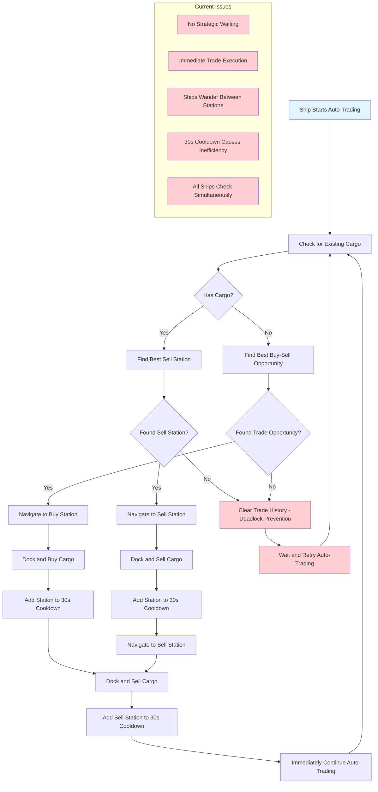
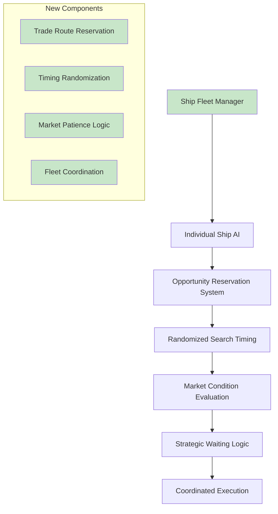
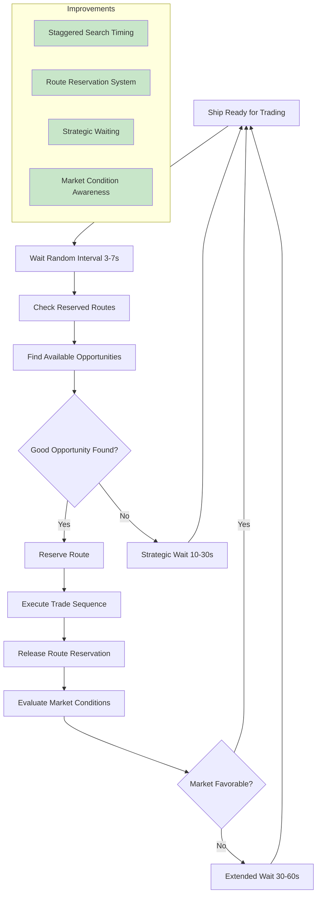

# Trading AI Analysis and Issue #24 Implementation Plan

## Current Trading AI System Overview

The trading AI system in Uncharted Territory implements automated trading for ships using a sophisticated multi-phase approach. This document analyzes the current implementation and outlines the improvements needed for Issue #24.

## Current Architecture

### Core Components

1. **TradingAI Class** (`/backend/src/trading-ai.ts`)
   - Main trading engine with 438 lines of code
   - Handles opportunity finding, command generation, and cooldown management
   - Uses 30-second cooldown system per station

2. **GameSession Integration** (`/backend/src/game-session.ts`)
   - 30Hz game loop using Cloudflare Alarms API
   - Processes auto-trade commands continuously
   - Manages ship movement and docking

3. **Economic System** (`/backend/src/economy.ts`)
   - 20+ ware types and station types
   - Real-time production/consumption simulation
   - Dynamic pricing with market variations

## Current Trading Flow



## Current Implementation Details

### Trade Opportunity Detection
- **Exploration Phase**: Scans all stations across all sectors
- **Decision Phase**: Selects opportunity with highest total profit
- **Execution Phase**: Generates movement and trading commands

### Key Methods
- `findBestTradeOpportunity()`: Main opportunity finder
- `generateTradingCommands()`: Creates command sequences
- `findBestTradeForWare()`: Evaluates specific ware opportunities
- `findSellOpportunityForCargo()`: Prioritizes selling existing cargo

### Cooldown System
- 30-second cooldown per station per ship
- Prevents immediate re-trading at same locations
- Causes ships to wander when blocked

## Identified Issues

### 1. Periodic Destination Changes (Wandering Behavior)
**Root Cause**: Ships immediately seek new opportunities when blocked by cooldowns

**Current Flow**:
```
Ship completes trade → Station added to cooldown → Ship finds new opportunity → 
Ship travels to new station → Process repeats
```

**Impact**: Ships appear to wander aimlessly between stations

### 2. Immediate Trade Execution
**Root Cause**: No strategic waiting or market timing consideration

**Current Behavior**:
- Ships execute trades immediately upon finding opportunities
- No evaluation of market conditions or timing
- No patience for better deals

### 3. Simultaneous Opportunity Checking
**Root Cause**: All ships check for opportunities at the same game tick

**Current Behavior**:
- Multiple ships target the same profitable routes
- Creates competition and inefficiency
- No coordination between ships

### 4. Fixed Cooldown System
**Root Cause**: 30-second fixed cooldown is too rigid

**Issues**:
- Too short for meaningful market changes
- Too long for quick arbitrage opportunities
- No consideration of market dynamics

## Issue #24 Requirements Analysis

### Primary Goals
1. **Add 2 Trading Ships**: Increase fleet from 1 to 3 trading ships
2. **Prevent Deadlocks**: Avoid ships targeting same opportunities
3. **Randomized Timing**: 5-second intervals with random variance
4. **Livlock Prevention**: Stop ships from bouncing between same locations

### Technical Requirements
1. **Multi-Ship Coordination**: Prevent ships from competing for same routes
2. **Staggered Search Timing**: 5±random seconds between opportunity searches
3. **Improved Deadlock Prevention**: Better algorithms beyond current trade history clearing
4. **E2E Test Updates**: Handle increased complexity in testing

## Proposed Solution Architecture

### 1. Enhanced Trading AI with Coordination



### 2. Improved Trading Flow



## Implementation Plan

### Phase 1: Core Infrastructure
1. **Trade Route Reservation System**
   - Prevent multiple ships from targeting same routes
   - Time-based reservations with automatic expiry
   - Priority system for ship coordination

2. **Randomized Search Timing**
   - Replace immediate execution with 5±random second intervals
   - Stagger ship search timings to prevent simultaneous checks
   - Configurable timing parameters

### Phase 2: Enhanced AI Logic
1. **Strategic Waiting Logic**
   - Evaluate market conditions before trading
   - Implement patience for better opportunities
   - Dynamic waiting times based on market state

2. **Improved Deadlock Prevention**
   - Better algorithms beyond current trade history clearing
   - Market condition-based route abandonment
   - Fallback strategies for stuck ships

### Phase 3: Fleet Management
1. **Add Additional Trading Ships**
   - Extend initial game state to include 3 ships
   - Ensure proper coordination between all ships
   - Test multi-ship scenarios

2. **E2E Test Updates**
   - Update test expectations for multiple ships
   - Add coordination and timing test scenarios
   - Validate deadlock prevention mechanisms

## File Modifications Required

### Primary Files
1. **`/backend/src/trading-ai.ts`**
   - Add route reservation system
   - Implement randomized timing
   - Enhance deadlock prevention

2. **`/backend/src/game-session.ts`**
   - Add multiple ships to initial state
   - Update auto-trade processing for coordination
   - Implement timing mechanisms

3. **`/backend/src/types.ts`**
   - Add route reservation types
   - Extend ship and game state types
   - Add timing configuration types

### Supporting Files
1. **`/frontend/src/components/ShipList.tsx`**
   - Update UI to handle multiple trading ships
   - Show coordination status and timing information

2. **`/tests/e2e/trading.spec.ts`**
   - Update tests for multiple ships
   - Add coordination and timing tests
   - Validate deadlock prevention

## Success Metrics

### Performance Metrics
1. **Reduced Wandering**: Ships should maintain consistent routes for longer periods
2. **Improved Efficiency**: Better profit per time unit across the fleet
3. **No Deadlocks**: Ships should not get stuck or loop indefinitely
4. **Coordination**: Multiple ships should work different routes simultaneously

### Technical Metrics
1. **Route Conflicts**: Minimize simultaneous targeting of same routes
2. **Timing Variance**: Achieve 5±random second search intervals
3. **Market Responsiveness**: Ships should adapt to changing market conditions
4. **Test Coverage**: Maintain comprehensive E2E test coverage

## Risk Assessment

### Technical Risks
1. **Complexity**: Multi-ship coordination adds significant complexity
2. **Performance**: Additional ships may impact game performance
3. **Timing**: Randomized timing might affect user experience
4. **Testing**: Increased test complexity and maintenance

### Mitigation Strategies
1. **Phased Implementation**: Implement changes incrementally
2. **Configuration**: Make timing and coordination parameters configurable
3. **Monitoring**: Add extensive logging and monitoring
4. **Fallbacks**: Implement graceful degradation for edge cases

## Conclusion

The current trading AI system is sophisticated but suffers from immediate execution and lack of coordination that causes wandering behavior. Issue #24 requires fundamental improvements to support multiple ships while preventing deadlocks and improving overall efficiency.

The proposed solution introduces strategic timing, route coordination, and market awareness to create a more realistic and efficient trading system. Implementation should be phased to manage complexity and ensure stability.

---

*Document created: 2025-07-03*  
*Analysis of: Uncharted Territory Trading AI System*  
*Issue: #24 - Multiple Trading Ships Addition*